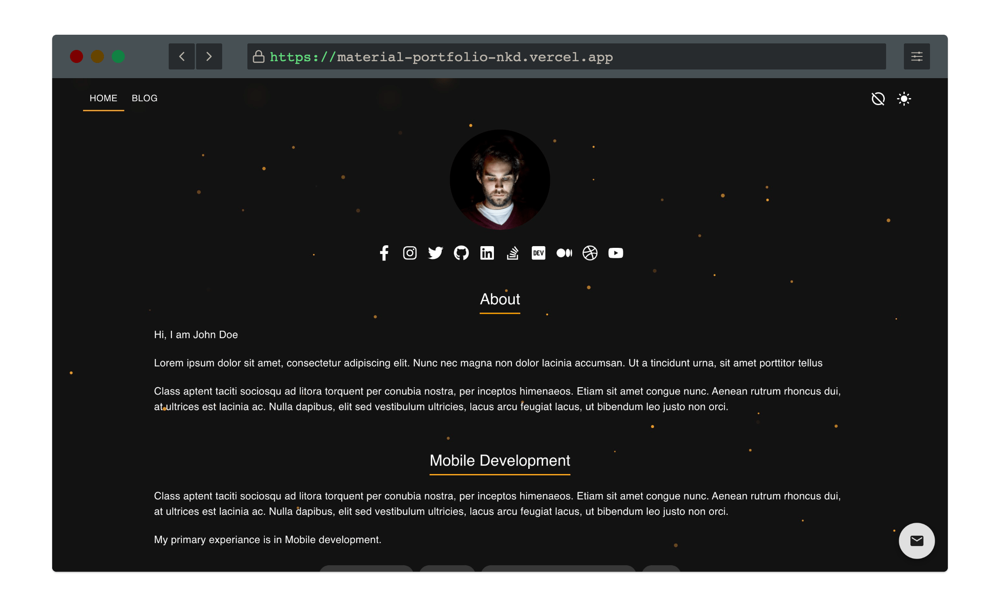
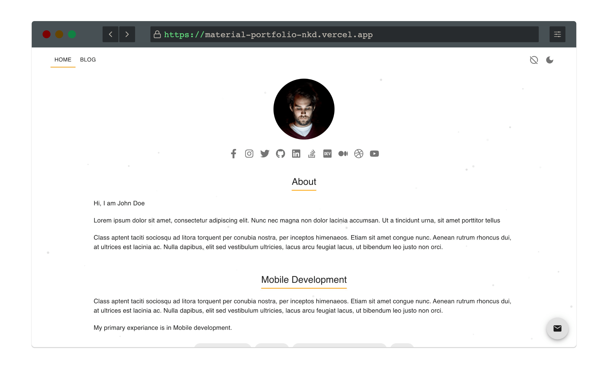
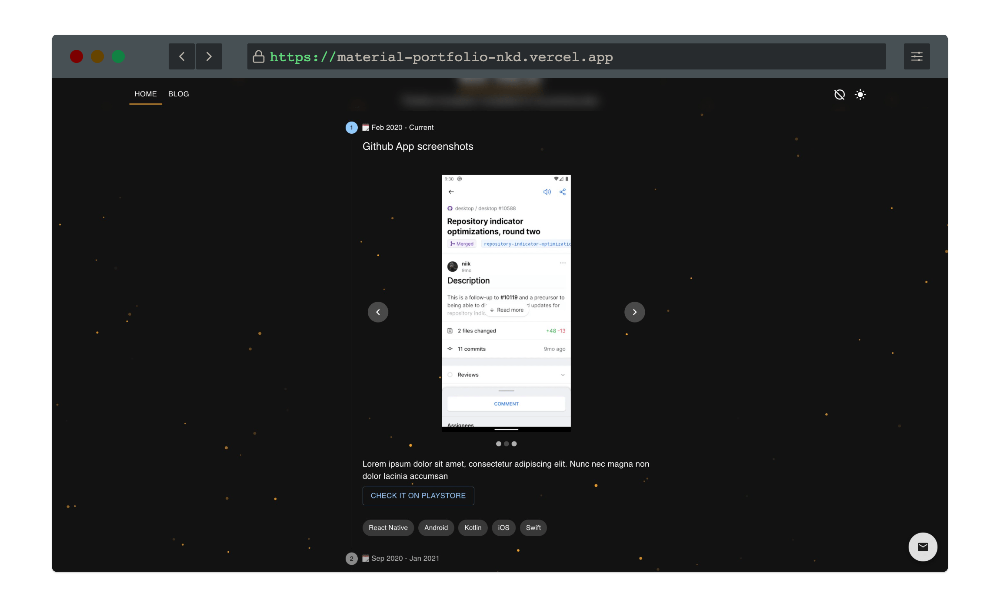
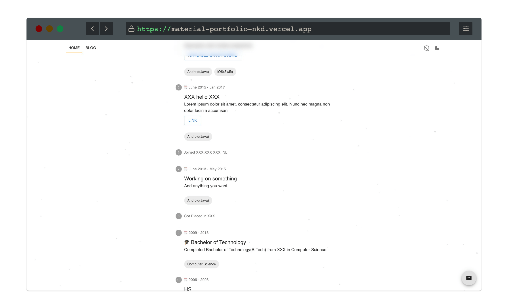
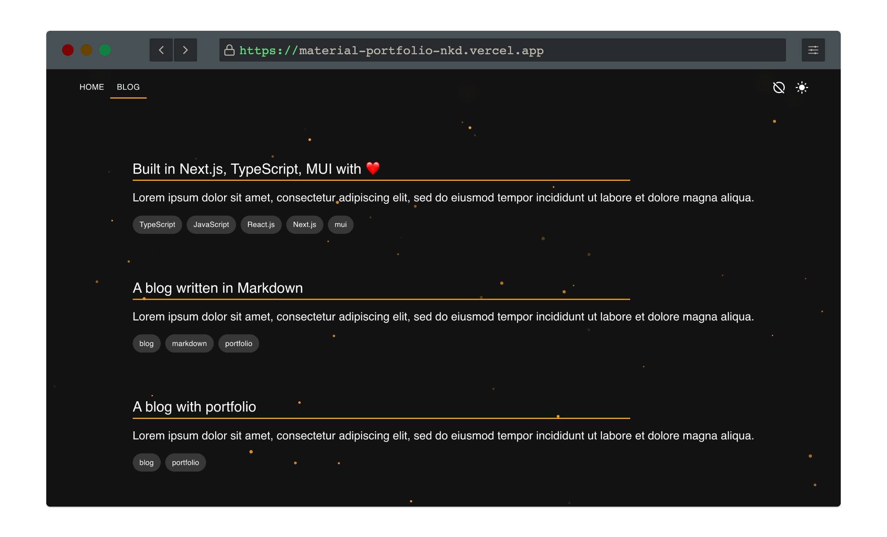
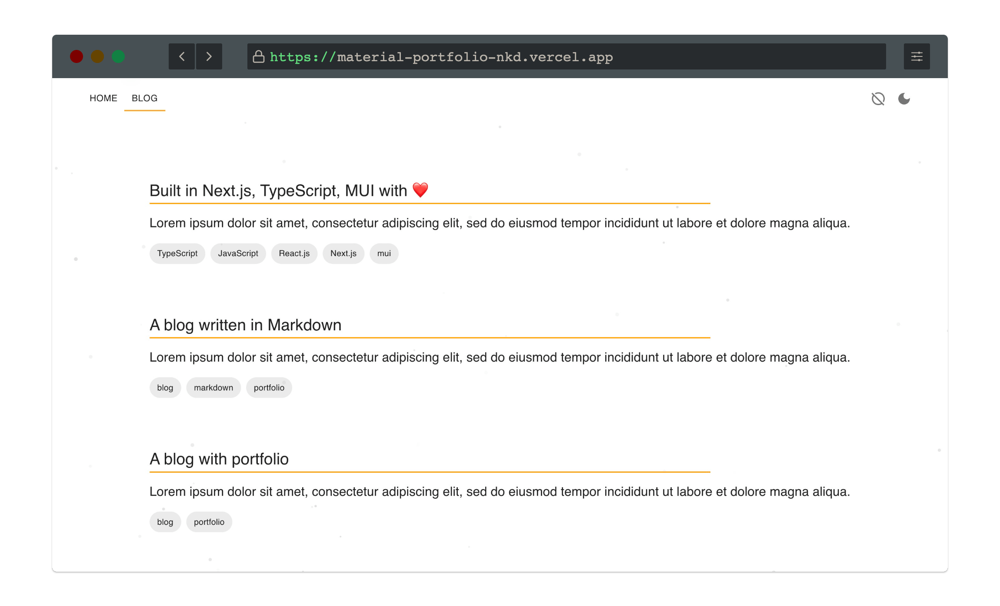
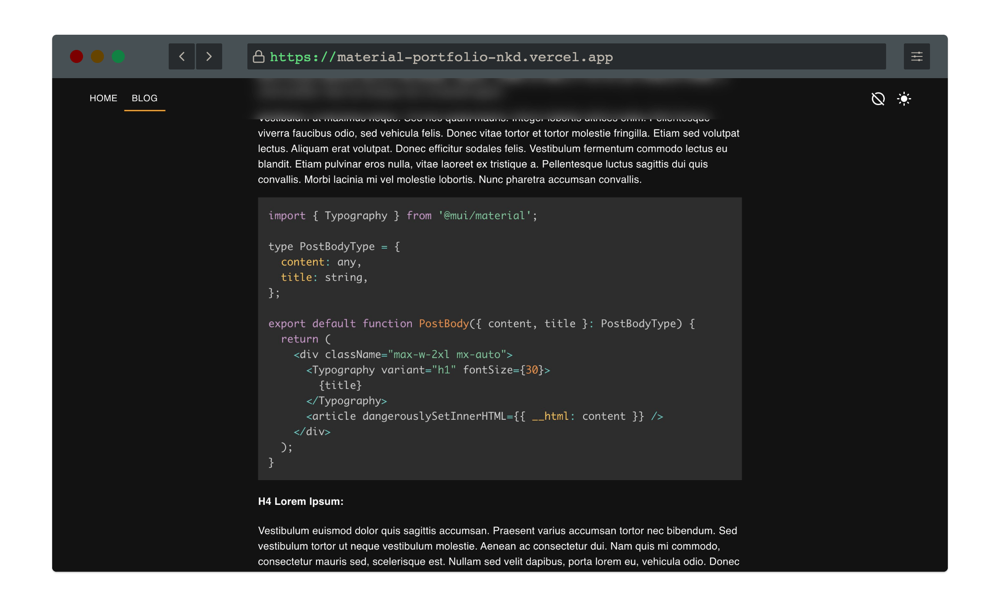
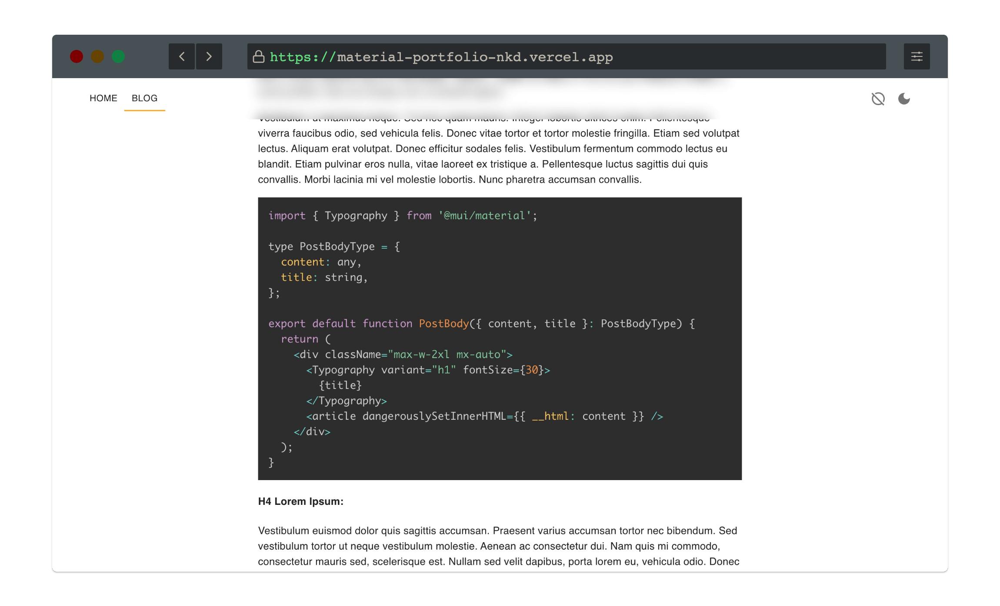
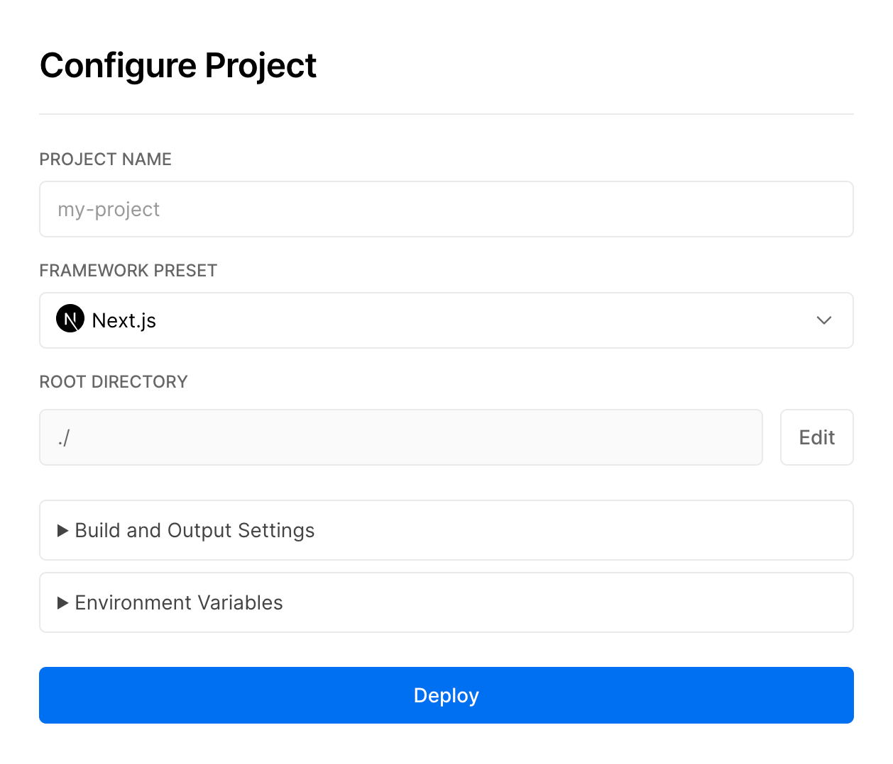

# Portfolio+Blog developed with MUI & NextJS(TypeScript):

# [Demo](https://material-portfolio-nkd.vercel.app/)

It is a Portfolio website and blog developed with MUI and NextJS in TypeScript. All data are editable without changing any code file.

#### Dark Mode home page:



#### Light Mode home page:



#### Timeline view of work history:



#### Customizable timeline view:



#### Dark Mode blog:



#### Light Mode blog:



#### Dark Mode blog post:



#### Light Mode blog post:



## Where you need to edit:

You need to put all image files in the _public_ folder. You can then edit the _data/data.json_ file to configure the home page.

It supports markdown, _.md_ format for blogs. Blog content should be in the _blog_ folder.

## JSON structure of data.json:

The base structure of _data.json_ is as like below:

```json
{
  name: string; // your name
  siteName: string; // site name
  profileImage: string; // relative path of profile image
  siteUrl: string; // site url
  contact: string; // [Optional] Email to contact
  footer: string; // Footer text
  facebook: string; // [Optional] Facebook url
  instagram: string; // [Optional] Instagram url
  twitter: string; // [Optional] Twitter url
  github: string; // [Optional] Github url
  linkedin: string; // [Optional] LinkedIn url
  stackoverflow: string; // [Optional] Stackoverflow url
  devto: string; // [Optional] dev.to url
  medium: string; // [Optional] Medium url
  dribble: string; // [Optional] Dribble url
  youtube: string; // [Optional] YouTube url
  description: Description[]; // detail is mentioned below
  steps: Steps[]; // detail is mentioned below
}
```

### Description[]:

An array of _Description_ objects. Each object is used to render the description boxes. In the demo website, these are _About_, _Mobile Development_ and _Web Development_.

Each object in this array looks as like below:

```json
{
  title: string; // title string
  description: string[]; // An array of string. Each string is used for a new line.
  tags?: string[]; // [Optional] Used to show the tags
}
```

### Step[]:

It is an array of _Step_ objects. Each _Step_ object is used to draw a timeline. You can add multiple timelines.

Each _Step_ object looks as like below:

```json
{
  title: string; // title of the timeline
  description: string; // description of the timeline
  data: StepData[]; // An array of content to show in the timeline
}
```

Each _StepData_ object looks as like below:

```json
{
  details: boolean; // boolean value.
  time: string; // timeline or anything that you want as step title
  label?: string; // [Optional] title to show for the timeline
  description?: string; // [Optional] description to show for the timeline
  tech?: string[]; // [Optional] An array of strings to show the tech stack/tools used
  images?: string[]; // [Optional] An array of relative paths of demo images
  links?: string[]; // [Optional] This array should hold only two values, first one is the name of the link and second one is the link
}
```

### Theme color configuration:

Color configuration is in _utils/Colors.ts_ file.

```typescript
export enum Colors {
  ACCENT = 'orange', // accent color
  HIGHLIGHT = 'red', // highlight color used in animation
  PARTICLES_DARK = '#ffa726', // particle color in dark mode
  PARTICLES_LIGHT = '#e0e0e0', // particle color in light mode
}
```

## Build and development commands:

You need to run _npm install_ or _yarn_ to install all dependencies before

### Run it locally:

You can use the below command to run the project in debug mode:

```
npm run dev
```

or,

```
yarn dev
```

### Prod build:

To create a production build, you need to first build the project:

```
npm run build
```

or,

```
yarn build
```

Once the build is completed, you can use the below command to run it:

```
npm run start
```

or,

```
yarn start
```

### Lint and Prettier:

To check for lint errors, use the below command:

```
npm run lint
```

or,

```
yarn lint
```

Similarly, to format with prettier,

```
npm run format
```

or,

```
yarn format
```

### Deploy it on vercel:

1. Clone the project
2. Login to Vercel and click _New Project_ on the [dashboard](https://vercel.com/dashboard)
3. Select the project from Github project lists and configure it.
   1. Add a project name
   2. Select framework preset as _Next.js_
   3. Keep others same and click on _Deploy_.


